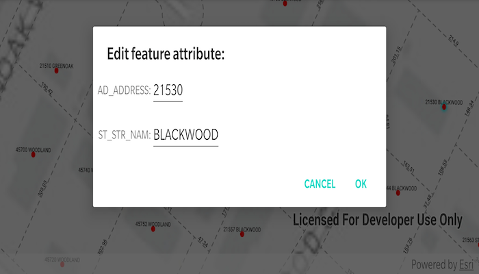

# Edit features with feature-linked annotation

Edit feature attributes which are linked to annotation through an expression.

## Use case

Annotation is useful for displaying text that you don't want to move or resize when the map is panned or zoomed (unlike labels which will move and resize). Feature-linked annotation will update when a feature attribute referenced by the annotation expression is also updated. Additionally, the position of the annotation will transform to match any transformation to the linked feature's geometry.

## How to use the sample

Pan and zoom the map to see that the text on the map is annotation, not labels. Tap one of the address points to update the house number (AD_ADDRESS) and street name (ST_STR_NAM). Tap one of the dashed parcel polylines to change its geometry.

The feature-linked annotation will update accordingly.

## How it works

1. Load the geodatabase. NOTE: Read/write geodatabases should normally come from a `GeodatabaseSyncTask`. That functionality is covered in the sample *Generate geodatabase*.
2. Create `FeatureLayer`s from `GeodatabaseFeatureTable`s found in the geodatabase with `geodatabase.geodatabaseFeatureTables`.
3. Create `AnnotationLayer`s from `GeodatabaseFeatureTable`s found in the geodatabase with `geodatabase.geodatabaseAnnotationTables`.
4. Add the `FeatureLayer`s and `AnnotationLayer`s to the map's operational layers.
5. Use a `DefaultMapViewOnTouchListener` to listen for taps on the map to either select address points or parcel polyline features. NOTE: Selection is only enabled for points and straight (signal segment) polylines.
6. For the address points, a dialog is opened to allow editing of the address number (AD_ADDRESS) and street name (ST_STR_NAM) attributes, which use the expression `$feature.AD_ADDRESS + " " + $feature.ST_STR_NAM` for annotation.
7. For the parcel lines, a second tap will change one of the polyline's vertices. Note that the dimension annotation updates according to the expression `Round(Length(Geometry($feature), 'feet'), 2)`.

Both expressions were defined by the data author in ArcGIS Pro using [the Arcade expression language](https://developers.arcgis.com/arcade/).

## Relevant API

* AnnotationLayer
* Feature
* FeatureLayer
* Geodatabase

## Offline Data

1. Download the data from [ArcGIS Online](https://arcgisruntime.maps.arcgis.com/home/item.html?id=74c0c9fa80f4498c9739cc42531e9948).
2. Extract the contents of the downloaded zip file to disk.
3. Open your command prompt and navigate to the folder where you extracted the contents of the data from step 1.
4. Push the data into the scoped storage of the sample app:
`adb push loudoun_anno.geodatabase /Android/data/com.esri.arcgisruntime.sample.editfeatureswithfeaturelinkedannotation/files/loudoun_anno.geodatabase`

## About the data

This sample uses data derived from the [Loudoun GeoHub](https://geohub-loudoungis.opendata.arcgis.com/)

## Tags

annotation, attributes, feature-linked annotation, fields
